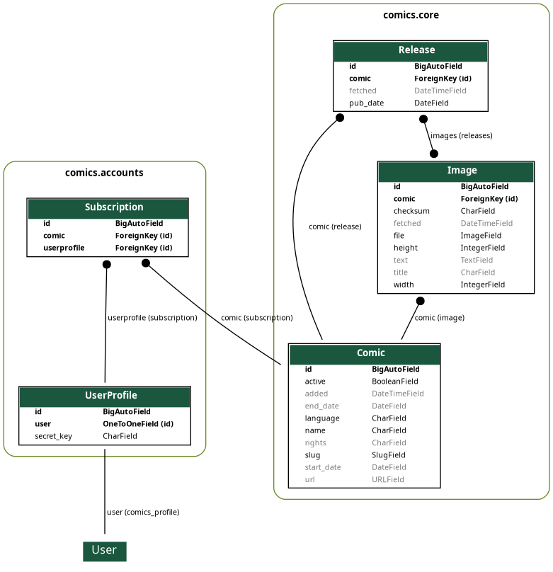

# Data model

Comics' data model is quite simple:

- The `comics.core` app consists of three models; `Comic`, `Release`, and
  `Image`.

- The `comics.accounts` app adds a `UserProfile` which add comic specific
  fields to Django's user model, including a mapping from the user to her
  preferred comics.



## Database migrations

Changes to the data model are managed using Django's
[database migrations](https://docs.djangoproject.com/en/stable/topics/migrations/).
If you need to change the models, please provide the needed migrations.

## Updating diagram

The above data model diagram was generated using the Django app
[django-extensions](https://github.com/django-extensions/django-extensions)
and the following command:

```sh
uv run comics graph_models \
  --output docs/images/data_model.png \
  --group-models \
  core accounts
```
