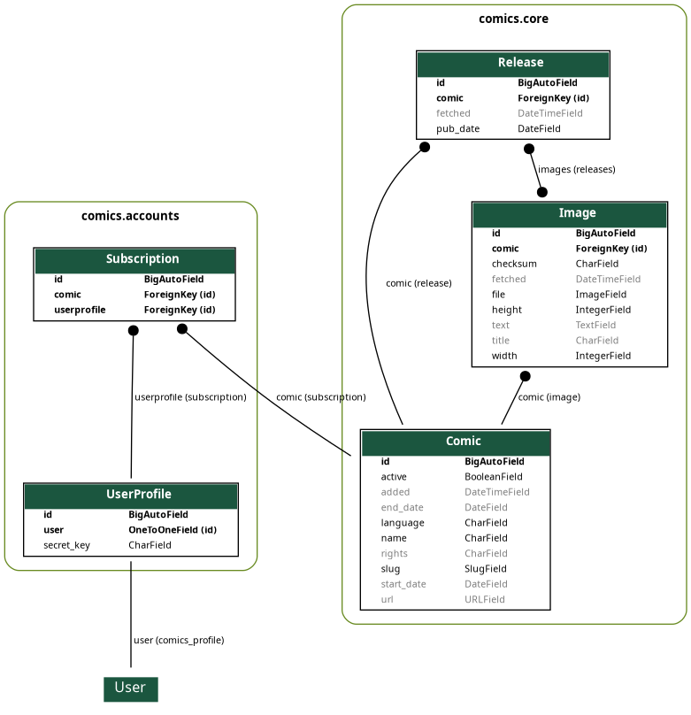

***********
Development
***********

*comics* development is coordinated through `GitHub <http://github.com/>`_.

How to contribute
=================

The easiest way to contribute to *comics* is to register as a user at GitHub,
fork `the comics project <http://github.com/jodal/comics>`_, and start hacking.
To get your changes back into *comics*' mainline, send a pull request to `jodal
at GitHub <http://github.com/jodal>`_, or send a mail to `comics@jodal.no
<mailto:comics@jodal.no>`_. Patches accompanied by tests and documentation
gives +5 karma and kudos.

Todo list
=========

A mostly unordered list of things to fix. Patches accepted.

Improvements
------------

``comics.aggregator.crawler._get_date_to_crawl()``
    Use comics time zone to crawl the correct current date.
``comics.aggregator.command``
    Use comic week schedule to crawl less often on non-schedule days.
``comics.core.models``
    Replace Strip.filename with an ImageField, and add fields for image height
    and width.
``comics.core.utils.navigation``
    Unit test and refactor.

New features
------------

- Support multiple strips per comic per day, which requires:

  - Change of naming scheme for image files from date to checksum.
  - Support for returning multiple ``CrawlerResult`` from one ``crawl()``.

Change specifications
=====================

When planning or doing larger changes to *comics*, notes may be added to the
documentation as a *change specification*.

.. toctree::
    :glob:

    specs/*

Data model
==========

*comics*' data model is very simple. The ``core`` app consists of three models;
``Comic``, ``Release``, and ``Strip``. The ``sets`` app adds an additional
model named ``Set``.

The above data model diagram was generated using the Django app
`django_extensions <http://code.google.com/p/django-command-extensions/>`_ and
the following command:

.. code-block:: sh

    python manage.py graph_models --settings=comics.settings.dev \
        --output=../docs/_static/data_model.png --group-models \
        core sets

Running tests
=============

*comics* got some tests, but far from full test coverage. If you write new or
improved tests for *comics*' functionality it will be greatly appreciated.

To run unit tests::

    python manage.py test --settings=comics.settings.testing

To run unit tests with statement coverage::

    python manage.py test --settings=comics.settings.coverage

